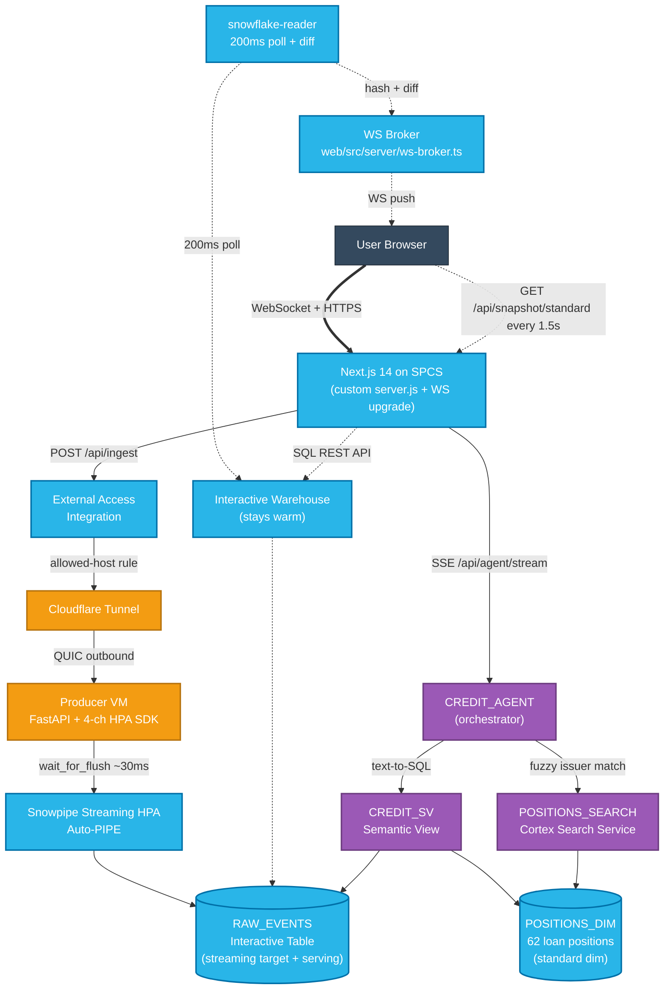

# Real-Time Credit Desk on Snowflake — Sub-Second React Dashboard

**Owner**: john.kang@snowflake.com (sfc-gh-jkang)

> **Feature status:** Snowpipe Streaming HPA, Interactive Tables, Cortex Agent, Cortex Search Service, Cortex Analyst (Semantic Views), and SPCS Snowflake Apps are all GA as of May 2026. No Preview features required to run this demo.

A real-time credit-trading dashboard. Operators on a credit desk fire trades, marks, and credit events; rows commit to Snowflake via Snowpipe Streaming HPA in ~30 ms; the dashboard shows the trade tape, P&L, sector exposure, top marks, watchlist, and a Cortex Agent chat that answers questions about the position book.

> Snowpipe Streaming **HPA** + **Interactive Tables** + **Cortex Agent** + **Next.js on SPCS** — same data pipeline as the parent fork, but the just-fired row appears optimistically in **~0.4 s** (click pipeline + a ~10 ms React render step, measured live in-browser) vs Streamlit's ~1.6 s full-script rerun — **~4× faster to see the row**, with full-dashboard freshness comparable (Streamlit numbers are a historical baseline from the parent demo — see provenance note below).

This is a performance fork of the parent demo `sfguide-snowpipe-streaming-interactive-demo` (Streamlit-on-Snowflake). The VM producer, the HPA SDK ingest path, the Interactive Tables, and the Cortex Agent spec are unchanged. The presentation layer is what's different: Streamlit on Snowflake is replaced by a Next.js 14 React app on SPCS, served behind Snowsight's OAuth gate. Tile updates run on a 200 ms server-side polling loop with WebSocket diff-push to the browser; full-snapshot fetches run client-side every 1.5 s as a periodic truth source.

## Why we built this

A typical real-time credit-desk pipeline is built from four separate vendors stitched together. This demo collapses all four into one Snowflake account.

| Capability | Traditional stack | What it costs you |
|---|---|---|
| Streaming ingest from desk apps | Kafka + Connect + schema registry | Cluster ops, broker tuning, consumer-lag dashboards, separate billing |
| Hot serving cache for sub-second tile reads | Redis or Memcached | Second source of truth, cache-invalidation bugs, separate auth/RBAC |
| Real-time stream processing (windows, joins, aggregations) | Flink, Spark Streaming, or Materialize | JVM tuning, watermark semantics, state-store recovery, runtime team |
| Conversational analytics over the same data | Looker / Tableau + a separate text-to-SQL bot | BI license fees, semantic-model drift, third-party LLM contract |

**The thesis: all four are now collapsed into one Snowflake account.** No Kafka. No Redis. No Flink. No external BI tier. The only thing outside Snowflake is the producer VM — and only because the HPA SDK's keypair-JWT auth currently has to originate outside SPCS.

What you see when you run this demo:

1. Click TRADE in the React dashboard → row commits via Snowpipe Streaming HPA in ~30 ms (`wait_for_flush()`)
2. Server-side reader polls the Interactive Warehouse every 200 ms → diffs against last hash → pushes only changed rows over WebSocket → tiles repaint in <16 ms
3. Switch to "Ask the Book" tab → ask "What was our most recent trade?" → Cortex Agent calls Cortex Analyst (semantic view) + Cortex Search → streams answer back in 5-10 s

## Why this fork exists

The latency table below mixes three number sources — live in-browser measurements, a 2026-07-07 re-benchmark of this fork's serving queries on the current architecture, and a historical Streamlit baseline. Each row is labeled, and the **Number provenance** note under the table spells out exactly what is measured live vs stored (see also `web/src/lib/baseline.ts`):

| Segment | Parent (Streamlit) | This fork (React) |
|---|---|---|
| HPA `wait_for_flush()` commit | ~30ms | ~30ms (unchanged) |
| Serving-query server-side time on **Interactive WH** | 60ms p50 / 95ms p95 *(historical: old single-row lookup, parent demo, 2026-05-19)* | **130ms p50 / 151ms p95** (n=30, book rollup, re-benchmarked 2026-07-07) |
| Same serving query on **Standard WH** (the in-app A/B toggle) | — | **295ms p50 / 872ms p95** (n=30) → Interactive ~2.3× faster p50, ~5.8× faster p95 |
| Streamlit full-script rerun | **1646ms p50 / 3391ms p95** *(historical, n=88 bursts, parent demo, 2026-05-19)* | n/a |
| **Click → optimistic row visible** | ~1646ms (rerun must finish first) | **~0.4s** (click pipeline + ~10ms render step, measured live) → **~4× faster to see the row** |
| React render/paint step (one row) | (part of the 1646ms rerun) | **~10ms** (RAF×2, measured live in-browser) — a render step, *not* a 1:1 comparison against a full rerun |
| Click → tape-row-visible (tape refresh) | ~1646ms (rerun completes, all rows redrawn) | ~2400ms (1.5s polling + ~800ms fetch + ~50ms reconcile) |
| Cortex Agent Q&A | 5-15s | 5-15s (unchanged) |

**Number provenance (important — don't conflate these):**
- **Live-measured, this fork, this session:** click→paint, network round-trip, HPA flush, IT-poll, WebSocket wire-delivery, render. These are timed in your browser on every click and shown labeled `MEASURED n=…` in the in-app Latency panel.
- **Re-benchmarked 2026-07-07 on the live `aws_spcs` account (current interactive-`RAW_EVENTS` architecture):** the Interactive-vs-Standard warehouse rows above (book-rollup serving query, 30× per WH, server-side `TOTAL_ELAPSED_TIME` via `QUERY_HISTORY_BY_SESSION`). Constants live in `web/src/lib/baseline.ts` → `REACT_FORK_SERVING_MS`.
- **Historical stored baseline (NOT re-measured live):** all Streamlit figures (`1646/3391ms` rerun; `60/95ms` and `98/241ms` per-WH profiles) were measured 2026-05-19 on the parent Streamlit-on-Snowflake demo, on a **different account** and the **old architecture**. The parent demo is not deployed on this account (a 30-day `QUERY_HISTORY` scan for `STPLATSTREAMLIT*` returned zero rows), so they cannot be refreshed here. They're an illustrative comparison, clearly labeled as such in the app.

**Honest read:** Streamlit's full-script rerun is the dominant cost — 1.6 s typical, 3.4 s p95 (historical baseline). The React fork's genuine win is that the just-fired row **appears optimistically in ~0.4 s vs Streamlit's ~1.6 s rerun (~4× faster to see the row)**; the React render/paint step itself is ~10 ms — a render step, not a fair 1:1 against a full rerun. On full-dashboard data freshness the two are comparable, and React additionally stays fresh between clicks (1.5 s polling) while Streamlit goes stale until the next rerun. On the interactive-vs-standard warehouse comparison, the Interactive WH is ~2.3× faster at p50 and ~5.8× faster at p95 for the identical serving query — measured fresh on the current architecture.

## Target latency budget

| Segment | Target | How |
|---|---|---|
| React render/paint step (after POST returns) | <50ms | React state diff + RAF×2 paint of the optimistic row |
| Click → optimistic row visible | ~0.4s | Click pipeline (net + SDK + flush) + the ~10ms render step |
| Click → row queryable from any connection | ~150-300ms | EAI to VM tunnel + SDK `wait_for_flush` |
| Click → row visible in tape (polling cadence) | ~2400ms | Server-side 1.5s polling, full snapshot fetch, Zustand reconcile |
| React tile re-render (memo'd diff) | <16ms | `React.memo` per slice, no full-page rerun |

**React render/paint step p50: <50 ms (typical 8-15 ms measured live). Click → optimistic row visible ≈ ~0.4 s (click pipeline + render step).**

## What this demo proves

A 10-second scan of which Snowflake products this demo exercises and what each one buys you.

| # | Snowflake product | What it does here | Why it matters |
|---|---|---|---|
| 1 | **Snowpipe Streaming HPA** (High-Performance Architecture) | Channel-API ingest from a Python SDK directly into `RAW_EVENTS` (an Interactive Table) via the auto-PIPE `RAW_EVENTS-STREAMING`. ~30 ms commit latency on `wait_for_flush()`. No landing table, no COPY INTO. | One ingest path for both micro-batch and per-row streaming; no Kafka, no Connect, no schema registry |
| 2 | **Interactive Tables** | `RAW_EVENTS` is itself the Interactive Table — Snowpipe Streaming writes rows straight into it, and the dashboard serves every tile from it. Clustered by `(EVENT_TS)`; position attributes are denormalized onto each event so tile queries need no dimension join. Sub-second concurrent reads. | Replaces a Redis cache; the same table is the system of record AND the hot serving layer |
| 3 | **Interactive Warehouses** | `CREDIT_DEMO_INT_WH` stays warm to serve the 200 ms server-side polling reader against `RAW_EVENTS`. | No JVM, no watermarks, no state-store recovery — just a warehouse that doesn't suspend |
| 4 | **SPCS Snowflake App** | Hosts the Next.js 14 dashboard on a `CPU_X64_XS` compute pool. OAuth via `/snowflake/session/token`. | Bring-your-own-runtime UI, deployed with `snow app deploy`, no separate infra to operate |
| 5 | **Cortex Agent** | `CREDIT_AGENT` orchestrates Cortex Analyst + Cortex Search to answer NL questions about the book. | Replaces a third-party text-to-SQL bot + BI semantic-model tier with one Snowflake-native object |
| 6 | **Cortex Analyst (Semantic Views)** | `CREDIT_SV` defines tables, dimensions, measures, and metrics that the agent's analyst tool turns into SQL. | One semantic model owned alongside the data; no Looker LookML drift |
| 7 | **Cortex Search Service** | `POSITIONS_SEARCH` indexes `POSITIONS_DIM` for fuzzy issuer/sector lookup ("show me Apollo's exposure"). | Built-in vector search; no Pinecone or external embedding pipeline |
| 8 | **External Access Integration** | `DASHBOARD_VM_EAI` lets the SPCS app POST to the cloudflared tunnel and lets the Buildpacks builder reach `npmjs.org`. | One auth/audit boundary for outbound network traffic from inside Snowflake |

## Architecture


### ASCII view

```
                            USER BROWSER
                                 │
                                 ▼ (HTTPS via Snowsight OAuth gate)
   ╔══════════════════════════════════════════════════════════════════╗
   ║  NEXT.JS 14 ON SPCS  (custom server.js with WS upgrade)        ║
   ║   • Live Credit Desk tab (WS push)   • Ask the Book tab (Agent SSE) ║
   ╚══════════════════════════════════════════════════════════════════╝
        │ POST /api/ingest                         │ POST /api/agent/stream
        │ (via External Access Integration)        │ (Cortex Agent OAuth)
        ▼                                          ▼
   [ Cloudflare Tunnel ]                    ┌────────────────────┐
        │                                   │  CREDIT_AGENT      │
        ▼                                   │  ├─ analyst tool   │
   [ Producer VM (any cloud)        ]       │  └─ search tool    │
   [   FastAPI + 4-channel HPA SDK  ]       └─────────┬──────────┘
        │ wait_for_flush                              │
        │ keypair JWT, ~30ms commit                   │ text-to-SQL
        ▼                                             ▼
   ┌─────────────────────────────────┐      ┌────────────────────┐
   │ Snowpipe Streaming HPA Auto-PIPE│      │  CREDIT_SV         │
   │ (channel API → RAW_EVENTS)      │      │  Semantic View     │
   │                                 │      │  + POSITIONS_SEARCH│
   │                                 │      │  Cortex Search     │
   ┌──────────────────────────────────────┐ └─────────┬──────────┘
   │ RAW_EVENTS   (Interactive Table)     │           │
   │   ← direct streaming target + serving│           │
   │ POSITIONS_DIM (62 loan positions,    │ ◄─────────┘
   │   standard dim; attrs denormalized   │
   │   onto each event)                   │
   └────────────────┬─────────────────────┘
                    │
        ┌───────────┴────────────┐
        │                        │
        ▼ 200ms server poll      ▼ 1.5s client snapshot poll
   ┌─────────────────────┐  ┌──────────────────────────────┐
   │ snowflake-reader    │  │ /api/snapshot/standard       │
   │ → hash → diff       │  │ → full positions/PnL/sector  │
   │ → WS push to all    │  │ → Zustand reconcile          │
   │   connected clients │  └──────────────────────────────┘
   └─────────────────────┘
```

Two concurrent paths into the browser:

- **WebSocket diff-push (200 ms cadence)** — `web/src/server/snowflake-reader.ts` polls the Interactive Warehouse, hashes the result, and pushes only changed rows over the WebSocket attached to `web/server.js`. Drives the live tape and tile flashes.
- **REST snapshot fetch (1.5 s cadence)** — the browser hits `/api/snapshot/standard` (or `/api/snapshot/at` for the Interactive WH variant), gets the full positions/PnL/sector/lag/topmarks rollup back, and merges it into Zustand. This is the periodic truth source that recovers from dropped WS messages, reconnections, and tab-switch rehydration.

### Mermaid view



**Key difference from parent:** The browser maintains a persistent WebSocket to the SPCS app (via `web/server.js`'s upgrade handler). The server-side reader polls the Interactive Warehouse at 200 ms cadence, hashes results, and pushes only diffs. `React.memo` prevents off-slice re-renders. Tiles update in <16 ms from WS message arrival.

## Quickstart

### TL;DR (5 commands)

```bash
cp .env.example .env                # then fill in 4 values
./deploy-app.sh --bootstrap         # provisions Snowflake + deploys dashboard
cd vm-ingest && cp .env.example .env && docker compose --profile quick up -d
docker logs credit-cloudflared-quick | grep trycloudflare    # paste URL into top-level .env INGEST_TUNNEL_HOST
cd .. && ./deploy-app.sh            # re-deploy with the tunnel host set
```

Then `snow app open --connection "$SNOWFLAKE_CONNECTION"` to launch the dashboard.

### 0. Prerequisites

- A Snowflake account where you have `ACCOUNTADMIN` (the bootstrap creates databases, roles, compute pools, EAIs)
- `snow` CLI 3.0+ with a connection profile pointed at that account (`snow connection list`)
- A VM somewhere reachable on the public internet that runs the cloudflared ingest tunnel (see [VM ingest setup](#vm-ingest-setup) below)
- A populated `.env` (copy from `.env.example`):
  - `SNOWFLAKE_CONNECTION` — name of your `snow` profile
  - `SNOWFLAKE_ACCOUNT` — account locator (e.g. `MYORG-MY_ACCOUNT`)
  - `INGEST_TUNNEL_HOST` — VM tunnel hostname (e.g. `*.trycloudflare.com` or your named tunnel host)
  - `INGEST_API_KEY` — shared secret the dashboard sends with every `/ingest` POST

The other 15 identifiers in `.env.example` (database, schema, warehouse, role, pool, EAI, table names) all have working defaults — only override if you need to coexist with another deployment in the same account.

### 1. Provision Snowflake objects + deploy the dashboard (one command)

```bash
./deploy-app.sh --bootstrap
```

This is idempotent and does everything end-to-end:

1. Renders `setup.sql`, `semantic_view.sql`, and `web/snowflake.yml` from your `.env`
2. Runs `setup.sql` — creates database, schema, warehouses (standard + Interactive), roles (`DASHBOARD_RL`, `CREDIT_INGEST_RL`), compute pool, network rules, External Access Integration, the `RAW_EVENTS` Interactive Table (streaming target + serving layer) + `POSITIONS_DIM`, Cortex Search service, Cortex Agent, `APP_CONFIG` runtime table, and all grants
3. Runs `semantic_view.sql` — creates the `CREDIT_SV` semantic view used by the agent for text-to-SQL
4. Pushes `INGEST_TUNNEL_HOST` + `INGEST_API_KEY` into `APP_CONFIG`
5. Updates the EAI network rule to allow egress to your tunnel host
6. `snow app deploy` — builds the Next.js standalone bundle inside SPCS and starts the service

The script ends by printing the live app URL. See [What gets created in your account](#what-gets-created-in-your-account) for the full inventory.

### 2. Generate keypair for the VM ingest user (one-time)

The VM connects to Snowflake with keypair JWT (not the SPCS OAuth path the dashboard uses). The bootstrap creates the `INGEST_ROLE` and grants but **leaves the actual `CREDIT_INGEST_USR` commented out** in `setup.sql` so you can paste the public key when you create it.

Run on the VM:

```bash
# Generate a 2048-bit RSA keypair
openssl genrsa 2048 | openssl pkcs8 -topk8 -inform PEM -out rsa_key.p8 -nocrypt
openssl rsa -in rsa_key.p8 -pubout -out rsa_key.pub

# Strip header/footer/newlines for the SQL CREATE USER
PUBKEY=$(awk 'NR>1 && !/-----END/ {printf "%s", $0}' rsa_key.pub)
echo "$PUBKEY"
```

Then in Snowflake (replace `<PUBKEY>` with the string from the previous step, and `${INGEST_ROLE}` with the value from your `.env`):

```sql
CREATE USER IF NOT EXISTS CREDIT_INGEST_USR
  TYPE = SERVICE
  RSA_PUBLIC_KEY = '<PUBKEY>'
  COMMENT = 'Snowpipe Streaming producer service account';
GRANT ROLE CREDIT_INGEST_RL TO USER CREDIT_INGEST_USR;
```

Place `rsa_key.p8` on the VM and point the worker's `SNOWFLAKE_PRIVATE_KEY_PATH` env var at it. See `vm-ingest/README.md` for the worker-side details.

### 3. Open the dashboard

`./deploy-app.sh` ends with `App ready at https://<id>-<account>.snowflakecomputing.app`. Open that URL, or run:

```bash
snow app open --connection "$SNOWFLAKE_CONNECTION"
```

The dashboard is served behind Snowsight's OAuth gate — Snowflake users in your account can hit the URL directly, no separate auth wiring needed.

### 4. Verify it's working

```bash
# 1. App health (should return {"ok":true,...} after warmup)
curl https://<your-app-host>/api/health

# 2. Tail the SPCS event log for errors
snow app events --connection "$SNOWFLAKE_CONNECTION" | tail -20

# 3. From the dashboard, click TRADE — the "click → tile paint" should be <50 ms
#    and the row should land in RAW_EVENTS within 500 ms cold / 100 ms warm.
```

If you see HTTP 502 with `{"error":"Ingest failed: INGEST_TUNNEL_HOST not configured"}`, the EAI network rule didn't pick up your tunnel host. Re-run `./deploy-app.sh` (no `--bootstrap` needed) — it re-pushes `APP_CONFIG` and re-applies the network rule.

### 5. Iterate

For code-only changes (React, API routes, server.js, etc.):

```bash
./deploy-app.sh
```

This skips `setup.sql` + `semantic_view.sql` and just re-builds the bundle and runs `snow app deploy`. Takes ~2-3 minutes vs ~15 minutes for `--bootstrap`.

For SQL changes (schema, agent spec, semantic view), re-run `--bootstrap` — it's idempotent. The Cortex Search service uses `CREATE IF NOT EXISTS`, so it's not rebuilt on subsequent runs (drop it manually if you change the search-service shape).

### 6. Teardown

```bash
# Stop + remove the SPCS app
snow app teardown --connection "$SNOWFLAKE_CONNECTION" --cascade

# Optional: drop the schema's demo objects (keeps the database)
snow sql --connection "$SNOWFLAKE_CONNECTION" --query "
  USE ROLE ACCOUNTADMIN;
  DROP AGENT IF EXISTS ${APP_DB}.${APP_SCHEMA}.${AGENT_NAME};
  DROP CORTEX SEARCH SERVICE IF EXISTS ${APP_DB}.${APP_SCHEMA}.${SEARCH_SERVICE_NAME};
  DROP SEMANTIC VIEW IF EXISTS ${APP_DB}.${APP_SCHEMA}.${SEMANTIC_VIEW_NAME};
  DROP EXTERNAL ACCESS INTEGRATION IF EXISTS ${DASHBOARD_EAI};
  DROP COMPUTE POOL IF EXISTS ${DASHBOARD_POOL};
  DROP ROLE IF EXISTS ${DASHBOARD_ROLE};
  DROP ROLE IF EXISTS ${INGEST_ROLE};
"
```

The compute pool stops billing the moment it's dropped. The Interactive Warehouse keeps charging credits until you drop or `ALTER WAREHOUSE ... SUSPEND` it (see [Cost note](#cost-note)).

## What gets created in your account

After `./deploy-app.sh --bootstrap` completes, your account contains the following objects. Names use the defaults from `.env.example` — override the corresponding env var to change any of them.

| Snowflake object | Default name | Controlled by | Notes |
|---|---|---|---|
| Database | `SNOWFLAKE_EXAMPLE` | `APP_DB` | Created with `IF NOT EXISTS`; reuses an existing database |
| Schema | `CREDIT_DEMO` | `APP_SCHEMA` | All demo objects live here |
| Standard warehouse | `CREDIT_DEMO_WH` | `STANDARD_WH` | XSMALL, AUTO_SUSPEND=30s — cheap, suspends fast |
| Interactive warehouse | `CREDIT_DEMO_INT_WH` | `INTERACTIVE_WH` | XSMALL, AUTO_SUSPEND=86400s (24h) — stays warm for sub-second reads |
| Compute pool | `DASHBOARD_POOL` | `DASHBOARD_POOL` | CPU_X64_XS, min 1 / max 1 instance — runs the SPCS Snowflake App |
| External Access Integration | `DASHBOARD_VM_EAI` | `DASHBOARD_EAI` | Bound to two network rules (build + ingest) |
| Network rule (ingest) | `DASHBOARD_INGEST_RULE` | `INGEST_NETWORK_RULE` | Egress to `<INGEST_TUNNEL_HOST>:443` |
| Network rule (build) | `DASHBOARD_BUILD_RULE` | (fixed) | Permissive `0.0.0.0:443` for `npm install` during SPCS Buildpacks |
| Ingest role | `CREDIT_INGEST_RL` | `INGEST_ROLE` | Read/insert on `RAW_EVENTS`, CREATE PIPE on schema |
| Dashboard role | `DASHBOARD_RL` | `DASHBOARD_ROLE` | Read-only on every demo object the dashboard touches |
| Stage | `CREDIT_STAGE` | `INGEST_STAGE` | Internal stage for SPCS app artifacts |
| Interactive Table | `RAW_EVENTS` | (fixed) | `CREATE INTERACTIVE TABLE`, `CLUSTER BY (EVENT_TS)` — Snowpipe Streaming HPA writes directly into it; the dashboard serves every tile from it. Position attributes denormalized onto each event. |
| Table | `POSITIONS_DIM` | (fixed) | Reference dimension (62 loan positions); seed source for the denormalized event attributes + Cortex Search |
| App config table | `APP_CONFIG` | `APP_CONFIG_TABLE` | Holds `INGEST_TUNNEL_HOST` + `INGEST_API_KEY` at runtime |
| Cortex Agent | `CREDIT_AGENT` | `AGENT_NAME` | Orchestrates analyst (text-to-SQL) + search tools |
| Semantic View | `CREDIT_SEMANTIC_VIEW` | `SEMANTIC_VIEW_NAME` | Backs the agent's text-to-SQL tool |
| Cortex Search Service | `CREDIT_SEARCH_SVC` | `SEARCH_SERVICE_NAME` | Fuzzy issuer lookup for the agent |
| SPCS Snowflake App | `CREDIT_DASHBOARD` | `DASHBOARD_APP_NAME` | The Next.js service itself |

The actual `CREDIT_INGEST_USR` user is **not** created automatically — you create it manually with the public key from §2 above.

## VM ingest setup

The VM runs a small FastAPI service (`vm-ingest/streaming_service.py`) that receives `/ingest` POSTs from the SPCS dashboard, validates the API key, and writes to `RAW_EVENTS` via the Snowpipe Streaming HPA SDK with keypair JWT auth. Cloudflare Tunnel handles the public-internet hop so SPCS doesn't need to know your VM's IP.

There are four supported tunnel patterns — pick whichever matches your environment:

| Path | Best for | Hostname stability | Setup time |
|---|---|---|---|
| **A. Quick tunnel** (`docker compose --profile quick`) | Smoke-test, single-laptop demo | Ephemeral `*.trycloudflare.com`, changes on every restart | ~30 s |
| **B. Named tunnel via API** (compose-embedded with `CLOUDFLARE_TUNNEL_TOKEN`) | Repeatable demos with a stable URL | Stable hostname survives restarts | ~5 min (one-time Cloudflare dashboard step) |
| **C. `vm-bootstrap.sh`** (host-installed cloudflared + systemd unit on Ubuntu) | Production-shaped on a long-lived VM | Stable hostname; survives VM reboots | ~10 min |
| **D. Terraform** (`vm-ingest/terraform/`) | Reproducible from-scratch GCP provisioning | Stable hostname + GCP VM lifecycle managed | ~5 min after `terraform apply` |

All four paths set `INGEST_TUNNEL_HOST` to a Cloudflare-issued hostname routed to `VM:8080`. Whichever you pick, paste the resulting hostname into the top-level `.env` and re-run `./deploy-app.sh` (no `--bootstrap` needed) — that updates `APP_CONFIG` and the EAI network rule.

See `vm-ingest/README.md` for the per-path commands and `TESTING.md` for the verified outcomes of each.

## Cost note

This demo is not free at idle. The breakdown:

| Resource | Idle behavior | Mitigation |
|---|---|---|
| `CREDIT_DEMO_INT_WH` (Interactive XSMALL) | `AUTO_SUSPEND=86400s` (24 h) — effectively always-on while demo is in use | `ALTER WAREHOUSE CREDIT_DEMO_INT_WH SUSPEND;` overnight, or drop entirely between demos |
| `DASHBOARD_POOL` (CPU_X64_XS, min=1) | `AUTO_SUSPEND_SECS=600` (10 min); auto-resume on next request | `ALTER COMPUTE POOL DASHBOARD_POOL SUSPEND;` between demos, or drop |
| `CREDIT_DEMO_WH` (Standard XSMALL) | `AUTO_SUSPEND=30s` — suspends fast on its own | No action needed; visible cold-start ~1-2 s on first hit after suspend |
| Cortex Search Service `CREDIT_SEARCH_SVC` | TARGET_LAG=1 minute — refreshes hourly-equivalent | Dropping it is the only way to stop the refresh credits |
| Snowpipe Streaming HPA Auto-PIPE | Per-row + per-flush charges; only fires when the VM POSTs events | Stop the VM container (`docker compose down` in `vm-ingest/`) when you're not demoing |

**Measured idle burn (last 7 days, aws_spcs demo, no human users — just the server-side reader + compute pool keeping themselves warm):**

| Resource | Credits/day |
|---|---|
| `CREDIT_DEMO_INT_WH` (Interactive XSMALL) | **~28** |
| `CREDIT_DEMO_WH` (Standard XSMALL) | ~0.8 |
| `DASHBOARD_POOL` (CPU_X64_XS, min=1) | ~0.8 |
| Cortex AI services + PIPE | ~0.05 (negligible) |
| **Total at idle** | **~30 credits/day** |

**Why the Interactive WH is ~28/day, not ~14/day (24h × 0.6 cr/hr XSMALL):** the compute side IS 0.6 credits/hour (24h × 0.6 = ~14 credits/day), but `web/src/server/snowflake-reader.ts` polls at `SCAN_INTERVAL_MS = 200ms` — roughly 432,000 queries/day. Each query is cheap on compute but each one hits the cloud-services tier (parsing, planning, result-set serialization, metadata reads). After the account-wide 10%-of-compute cloud-services rebate, the net billed comes out around 1.18 credits/hour — almost 2× the bare compute rate.

**To trim the cost without sacrificing the demo:**

- **Suspend overnight**: `ALTER WAREHOUSE CREDIT_DEMO_INT_WH SUSPEND;` → daily burn drops to <2 credits/day during off hours.
- **Bump the poll cadence**: change `SCAN_INTERVAL_MS` from 200 → 500 or 1000 ms in `web/src/lib/constants.ts`. Halves or quarters the cloud-services line; tile-paint UX is dominated by optimistic React state, so users don't feel the slower server poll.
- **Skip the SQL when no clients are connected**: gate `snowflake-reader` on `wsBroker.clientCount() > 0`. Idle dashboard with zero browsers = zero queries, zero cloud-services credits.

At a typical effective enterprise rate (~$2/credit) this demo idle costs roughly **$60/day** if left running 24/7, or **~$4/day** if you suspend the Interactive WH between demos.

## File map

| Path | Purpose |
|---|---|
| `setup.sql` | Single source of truth for all Snowflake DDL (database/schema/warehouses/pool/EAI/roles/tables/agent/search service/grants), envsubst-templated from `.env` |
| `semantic_view.sql` | Defines `CREDIT_SV` for the agent's text-to-SQL tool, also envsubst-templated |
| `web/snowflake.yml` | Snowflake App manifest for SPCS deployment, envsubst-templated |
| `deploy-app.sh` | Render templates → run setup SQL (with `--bootstrap`) → push runtime config → `snow app deploy` |
| `.env.example` | All 23 envsubst variables with documented defaults |
| `web/server.js` | Custom standalone server that monkey-patches Next.js's `server.js` to handle WebSocket upgrades on `/api/ws` |
| `web/src/app/layout.tsx` | Root layout with the two-tab nav (Live Credit Desk / Ask the Book) and global WS provider |
| `web/src/app/page.tsx` | Live Credit Desk page — KPI tiles, latency timeline, live tape, sector donut, top marks, watchlist |
| `web/src/app/ask/page.tsx` | Ask the Book page — Cortex Agent chat with SSE streaming |
| `web/src/app/api/health/` | Liveness probe (returns `{ok: true, ...}`) |
| `web/src/app/api/warmup/` | Pre-warms the Snowflake connection + reader on first request |
| `web/src/app/api/ws/` | WebSocket route (handled by `server.js` upgrade handler, not a Next.js route handler) |
| `web/src/app/api/snapshot/standard/` | Snapshot rollup using the standard warehouse (cold-start visible) |
| `web/src/app/api/snapshot/at/` | Same rollup using the Interactive warehouse (stays warm) |
| `web/src/app/api/ingest/` | POST proxy to VM tunnel (optimistic + verified WS broadcast) |
| `web/src/app/api/ingest-batch/` | Same as `/api/ingest` but accepts an array — used by stress-test buttons |
| `web/src/app/api/agent/stream/` | SSE proxy to Cortex Agent `:run` endpoint |
| `web/src/app/api/observability/` | Pipeline observability metrics for the diagnostic panel |
| `web/src/app/api/debug/` | Internal debug endpoints (config dump, connection test) |
| `web/src/server/snowflake-client.ts` | OAuth token + SQL Statements REST API client (the canonical SPCS path) |
| `web/src/server/snowflake-reader.ts` | 200 ms diff poll loop that drives WS push |
| `web/src/server/ws-broker.ts` | Connected-client registry + broadcast helpers |
| `web/src/server/agent-proxy.ts` | Cortex Agent SSE event-stream parser + adapter |
| `web/src/server/queries.ts` | Snapshot SQL strings (positions, PnL, sector, lag, top marks, day metrics, watchlist) |
| `web/src/server/vm-proxy.ts` | `/api/ingest` → VM tunnel forwarder with retry/timeout |
| `web/src/server/config.ts` | Server-side env mirror (`APP_DB`, `APP_SCHEMA`, `INTERACTIVE_WH`, etc.) |
| `web/src/lib/constants.ts` | Client-side constants (`POLL_INTERVAL_MS=1500`, `SCAN_INTERVAL_MS=200`, NEXT_PUBLIC_* mirrors) |
| `web/src/components/` | 18 React components (KpiTiles, LiveTape, EventGenerator, AgentChat, etc.) |
| `vm-ingest/` | VM producer (FastAPI + HPA SDK), 4 cloudflared tunnel paths, optional Terraform |
| `ASSUMPTIONS.md` | Architecture decisions + latency budget |
| `MIGRATION.md` | Diff from parent fork + side-by-side instructions |
| `TALK_TRACK.md` | 8-min demo script highlighting the latency win |
| `TESTING.md` | Test coverage matrix + verified E2E reproduction steps |
| `TROUBLESHOOTING.md` | Common issues + recovery |
| `CONTRIBUTING.md` | Internal-only contribution policy + development setup |

## Demo script (8 minutes)

| Minute | Action | What to point out |
|---|---|---|
| 0:00 | Open dashboard | 62-position book loads instantly (WS connected, initial snapshot pushed) |
| 0:30 | Point at the architecture | "Same HPA pipeline as before — the only change is what renders the data" |
| 1:00 | Click **TRADE** | Latency timeline breaks down the round trip (net + SDK + flush). Optimistic row appears grey in ~0.4s, then goes green when the IT confirms; the React render step is ~10ms |
| 2:00 | Click 5x rapidly | All 5 bars stack. Each render/diff is a few ms; rows appear optimistically in well under half a second. "That's the React diff — no full-page rerun" |
| 3:00 | Open parent fork in adjacent tab | Click the trade button there. Watch the 1.6-3.4s rerun. "Same data, same HPA commit — different framework" |
| 4:00 | Switch back to React fork | "That's the A/B. Everything Snowflake-side was already sub-second." |
| 5:00 | Switch to **Ask the Book** tab | "What is today's P&L by sector?" — Cortex Agent streams tokens via SSE |
| 6:00 | Fuzzy search | "Show me Apollo's exposure" — same Agent, same Search service |
| 7:00 | The closer | Click TRADE in the Live Credit Desk tab, switch to Ask the Book and ask "What was our most recent trade?" — same row, shown optimistically on the tile in ~0.4s and findable by the Agent in 5-10 s |

The Live Credit Desk tab also has **MARK** and **CREDIT** buttons next to TRADE for mark-to-market price updates and credit events (rating changes, defaults, restructurings).

## Glossary

Terms used throughout the README, in case you're not deep in the Snowflake stack:

| Term | What it means here |
|---|---|
| **HPA** | High-Performance Architecture — Snowflake's GA Snowpipe Streaming engine. Sub-100 ms row commits via the Java/Python SDK. Replaces the older Snowpipe (file-based, minute-scale) for streaming workloads. |
| **Auto-PIPE** | The named `PIPE` object the HPA SDK auto-creates the first time you open a channel against a table. Format: `<TABLE>-STREAMING`. You don't manage it directly. |
| **Interactive Table** | A Snowflake table type (`CREATE INTERACTIVE TABLE`) optimized for sub-second concurrent reads, with `CLUSTER BY` clustering. Can be a **direct Snowpipe Streaming target** (rows appended via the channel API, as `RAW_EVENTS` is here) or auto-refreshed from a source with `TARGET_LAG`. Same SQL surface as a regular table; different storage/serving engine. Supports Time Travel even under continuous streaming writes. |
| **Interactive Warehouse** | A warehouse SKU that stays warm to query Interactive Tables. XSMALL ≈ 0.6 credits/hour compute. Long `AUTO_SUSPEND` keeps it serving sub-second reads. |
| **SPCS** | Snowpark Container Services — Snowflake's container hosting layer. Runs your Docker image on a `compute pool` you create. This dashboard runs on SPCS. |
| **Snowflake App** | An SPCS deployment unit (`snow app deploy`). Bundles a `snowflake.yml` manifest + your code stage. Snowsight handles auth/routing for you (the dashboard is gated by Snowsight OAuth). |
| **Buildpacks** | The build system `snow app deploy` uses. No Dockerfile required — it detects your stack (Next.js here) and produces an image automatically. |
| **EAI** (External Access Integration) | A Snowflake object that whitelists outbound network access from inside the platform. The dashboard uses one EAI bound to two network rules: a permissive build-time one (npm registry) and a narrow runtime one (only the cloudflared tunnel host). |
| **Cortex Agent** | A Snowflake-native agent object (`CREATE AGENT`). Orchestrates Cortex Analyst (text-to-SQL) + Cortex Search (semantic lookup) tools. Streams responses via SSE. |
| **Cortex Analyst** | Snowflake's text-to-SQL service, configured via a `CREATE SEMANTIC VIEW` definition that names the dimensions/measures the LLM can use. |
| **Semantic View** | A Snowflake object (`CREATE SEMANTIC VIEW`) that declares the tables, dimensions, and metrics in business-friendly terms. Backs Cortex Analyst's text-to-SQL. |
| **Cortex Search Service** | A Snowflake-native vector + keyword search index (`CREATE CORTEX SEARCH SERVICE`). Used here for fuzzy issuer lookup ("Apollo"). |
| **OAuth token at `/snowflake/session/token`** | The path inside an SPCS container where Snowflake mounts a short-lived OAuth token bound to the app's owner role. The dashboard reads this on every API call instead of using a PAT or keypair. |

## Coexistence with parent fork

If you've already deployed the parent Streamlit fork to the same account, you can run both demos side-by-side for the latency A/B. Set `APP_DB` and `APP_SCHEMA` in `.env` to the parent's database/schema (default `SNOWFLAKE_EXAMPLE.CREDIT_DEMO`); `--bootstrap` is idempotent and reuses existing objects. The new objects are `DASHBOARD_*`-prefixed and don't collide with the parent's `CREDIT_*` objects:

- `DASHBOARD_POOL` (parent uses `CREDIT_POOL`)
- `DASHBOARD_VM_EAI` (parent uses `CREDIT_INGEST_EAI`)
- `DASHBOARD_RL` (parent's `CREDIT_INGEST_RL` is reused, not duplicated)

The VM producer, `RAW_EVENTS`, `POSITIONS_DIM`, `CREDIT_AGENT`, and `CREDIT_SV` are shared. If you're starting from a fresh account with only this fork, you don't need to think about coexistence — `--bootstrap` creates everything from scratch.

## Repository Owner

- **Owner:** John Kang (john.kang@snowflake.com / [@sfc-gh-jkang](https://github.com/sfc-gh-jkang))
- **License:** Apache-2.0 — see [LICENSE](LICENSE)

## License

Apache License, Version 2.0. See [LICENSE](LICENSE).

## Disclaimer

This is a Snowflake Sales Engineering sample, not an officially supported Snowflake product. The position book, issuers, trades, marks, and credit events are all synthetic. ACME Credit Management is fictional.

## Known gotchas (and what we tried)

These bugs were hit during the initial build. Documenting here so future contributors don't repeat them.

### 1. `next.config.ts` not supported

**Symptom**: Build fails immediately with a confusing parse error.

**Fix**: Must use `next.config.js` with `module.exports = { ... }`. TypeScript config files (`.ts`) are not reliably supported by the Next.js 14 standalone build pipeline, especially when running inside a Docker multi-stage build.

### 2. `output: "standalone"` required for SPCS

**Symptom**: `snow app deploy` extracts to `/tmp/_spcs_runner/` and Node can't find the entry point. The app crashes with `MODULE_NOT_FOUND`.

**Fix**: Set `output: "standalone"` in `next.config.js`. Run with `node .next/standalone/server.js`. This produces a self-contained Node.js server without needing the full `node_modules/` tree.

### 3. `snowflake-sdk` OAuth callbacks don't fire inside SPCS

**Symptom**: Connection object is created, `connect()` callback fires, but no queries actually execute. The SDK silently drops requests.

**Fix**: Replaced the Node.js SDK entirely with a direct REST API client to `/api/v2/statements`, reading the OAuth token from `/snowflake/session/token`. See `web/src/server/snowflake-client.ts`. This is more reliable in SPCS because it doesn't depend on the SDK's internal connection state machine.

### 4. UTC vs PT timestamp skew

**Symptom**: `AGE_SEC` values are negative (e.g., -24264s). Events appear "from the future."

**Root cause**: `CURRENT_TIMESTAMP()` returns the session's local timezone (LTZ). The VM producer writes `EVENT_TS` as UTC walltime. Subtracting LTZ from UTC produces garbage when the session timezone isn't UTC.

**Fix**: Use `SYSDATE()` which always returns UTC regardless of session timezone. See `web/src/server/queries.ts` — all age/freshness calculations use `SYSDATE()`.

### 5. Next.js 14 fetch Data Cache

**Symptom**: Dashboard polls Snowflake every 1.5s, but `INFORMATION_SCHEMA.QUERY_HISTORY` shows 0 queries. The UI displays stale data that never updates. Verified: 21 snapshot polls in 30s produced 0 actual Snowflake queries.

**Root cause**: `dynamic = "force-dynamic"` in the route handler only disables the Full Route Cache (rendered HTML output). It does NOT disable the Data Cache that wraps every `fetch()` in server-side code. Identical POST bodies (same SQL string every 1.5s) are deduplicated by the Data Cache and never hit the wire.

**Fix**: Add `cache: "no-store"` to every server-side `fetch()` call. See `web/src/server/snowflake-client.ts`. This is a **hard requirement** — any new `fetch()` added to server code without `cache: "no-store"` will be silently cached.

### 6. SPCS OAuth token can't switch roles

**Symptom**: Every Snowflake API call returns `390186 Role 'DASHBOARD_RL' specified in the connect string is not granted to this user`, even after `GRANT ROLE DASHBOARD_RL TO USER <deploying-user>`.

**Root cause**: The OAuth token mounted at `/snowflake/session/token` inside SPCS is a **scoped token** bound to a single role (the app owner role). Sending `role: "DASHBOARD_RL"` in the request body of `/api/v2/statements` triggers a role-switch the token isn't allowed to perform — independent of what the underlying user is granted.

**Fix**: Don't send `role:` in the API body. Let the token use its bound default role. The deploying user's role already has all the read access the dashboard needs (granted via `setup.sql`). The intended read-only scoping (`DASHBOARD_RL`) is preserved at the SQL/object-grant layer; the runtime just doesn't switch into it. See `web/src/server/snowflake-client.ts:72`.

